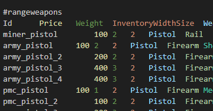

# Quasimorph QM_DataExport

Extracts the game's config_* data to the app data folder.

The data can be found at `%AppData%\..\LocalLow\Magnum Scriptum Ltd\Quasimorph\QM_DataExport\Data`. with the extension of .tsv.

The data is extracted directly from the game's resources.  The files often contain more than one table, with each table being preceded by a #<table name>.

The item ids generally do not match the name displayed in the game, so the user will need to find the actual item ids themselves.  

# ID Support

Unfortunately, I will not assist in finding the ids in the files for users.

# Support
If you enjoy my mods and want to buy me a coffee, check out my [Ko-Fi](https://ko-fi.com/nbkredspy71915) page.
Thanks!

# Source Code
Source code is available on GitHub at https://github.com/NBKRedSpy/QM_DataExport
